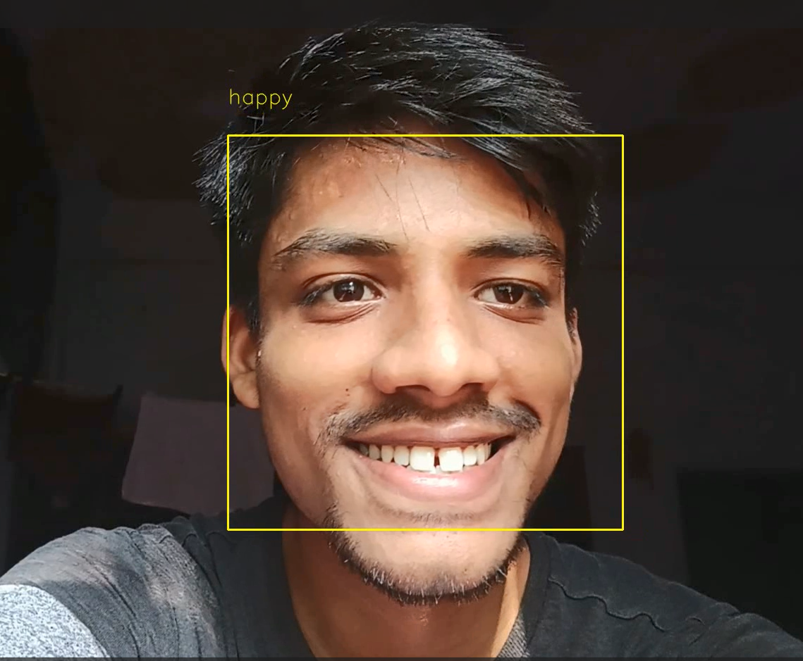

# MoodLens 🎥🙂  
**Facial Emotion Detection from Video Using Deep Learning (FER2013 + CNN)**

MoodLens is a deep learning-powered application that detects and classifies human emotions from video input. It processes a video uploaded by the user, identifies faces frame-by-frame, classifies each detected face's mood using a pre-trained CNN model, and outputs a new annotated video highlighting the detected emotions.

---

## 📌 Features

- 🎬 **Video Input**: Accepts video files from the user.
- 🧠 **Deep Learning Model**: Uses a CNN trained on the FER2013 dataset.
- 😊 **Emotion Recognition**: Detects and classifies emotions as:
  - Anger
  - Neutral
  - Happy
  - Sad
  - Surprised
  - Disgust
  - Fear
- 🖼️ **Face Detection**: Locates and marks human faces in each frame.
- 🏷️ **Annotation**: Outputs a processed video with bounding boxes and mood labels.

---

## 🧠 Model Details

- **Dataset Used**: [FER2013](https://www.kaggle.com/datasets/msambare/fer2013)
- **Model Type**: Convolutional Neural Network (CNN)
- **Input Shape**: 48x48 grayscale images
- **Training Details**:
  - Optimizer: Adam
  - Loss: Categorical Crossentropy
  - Epochs: Customizable
- **Model Output**: Saved `.hdf5` file used for inference

---

## ⚙️ Tech Stack

| Component | Technology |
|----------|------------|
| Model Training | TensorFlow / Keras |
| Face Detection | OpenCV |
| Video Processing | OpenCV |

---

## 🚀 Installation & Setup

1. **Clone the Repository**
   ```bash
   git clone https://github.com/lakhotiaharsh/Moodlens
   cd moodlens

2. **Install Dependencies**
    ```bash
    pip install -r requirements.txt

3. **Train Model(Optional)**
    ```bash
    python unzip.py
    python train.py

## 📦 Usage

### **Run Emotion Detection on a Video**

- To run the code use the following command
  ```bash
  python output.py

## 📸 Output Example


## 📝 Summary
MoodLens is a facial emotion detection system that analyzes video footage, identifies human faces, and classifies their emotional state using a CNN model trained on the FER2013 dataset. It outputs an annotated video displaying the emotional mood of each person across frames.
